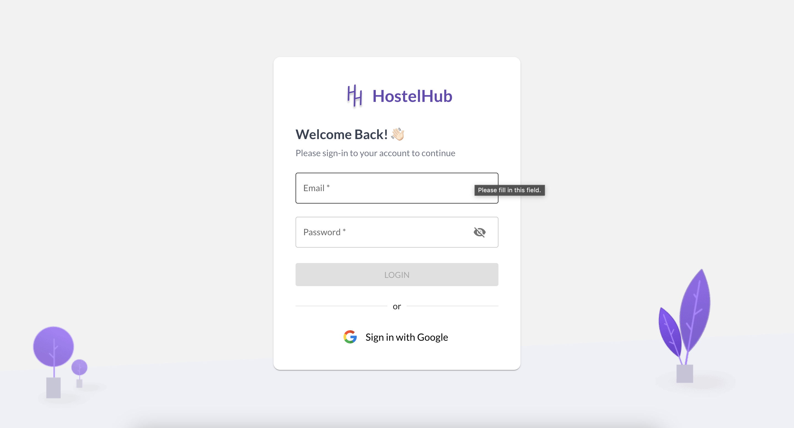
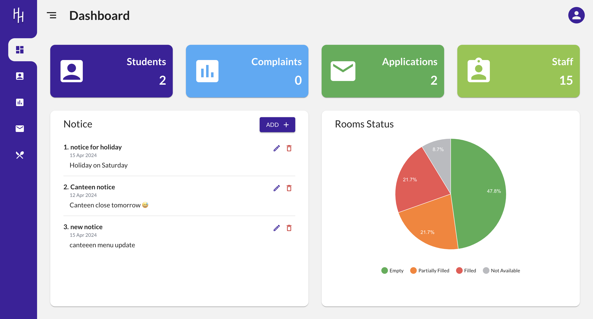
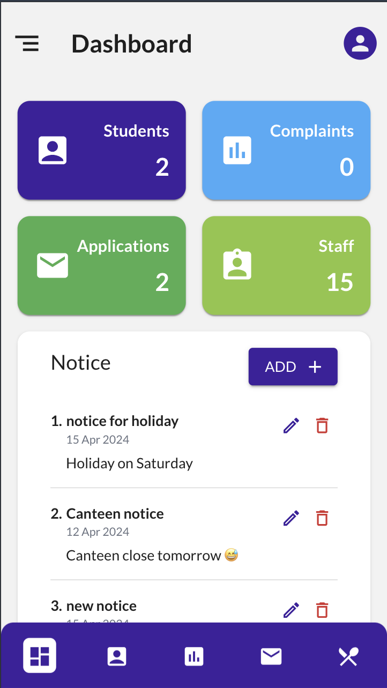
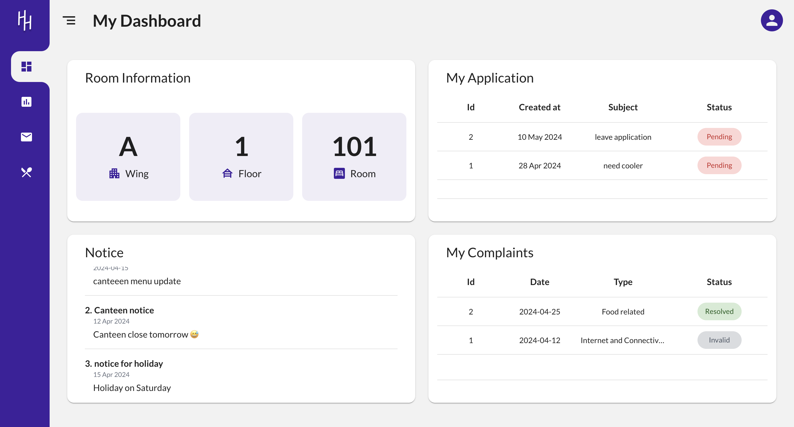
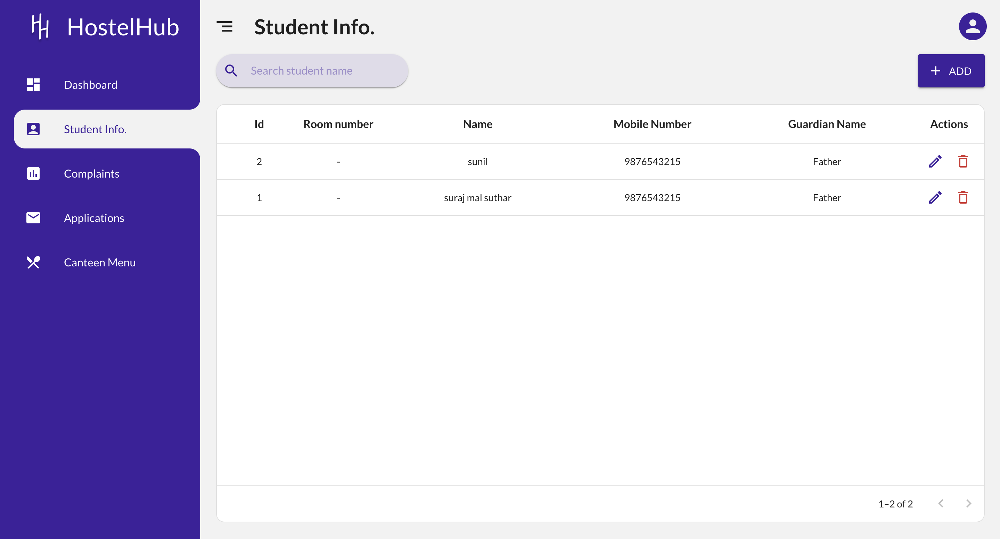
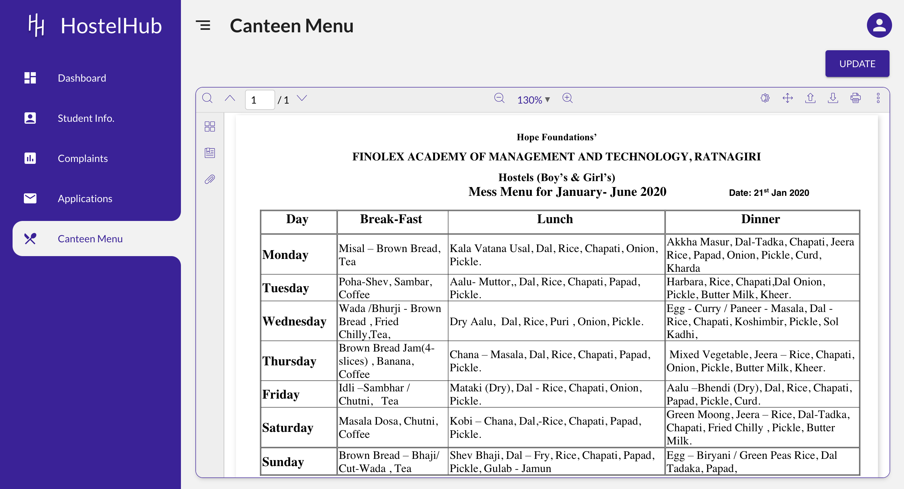

# HostelHub

Revolutionizing hostel management, the Progressive Web App (PWA) offers unparalleled convenience and accessibility. Streamlining tasks like student management, notice posting, complaints handling, application management, and menu updates, it ensures a seamless user experience across devices. With advanced features like error handling and efficient loading, coupled with top-notch code quality, the PWA sets the standard for modern development practices. Implemented tools such as ESLint and Husky ensure better code quality, ensuring a well-organized and technologically advanced hostel environment aligned with modern development practices.

`College Final year Project PWA app "Hostel Management" but redefined`

## Project Links

- **Backend Repository**: [HostelHub Strapi](https://github.com/krishnaagarwal1506/hostelhub-strapi)
- **Deployed Project**: [HostelHub Deployment](https://hostelhub-g5jc.onrender.com/)
  - Note: The deployed website may take about ~1 minute to load as the server takes time to start.

## Installation and Setup

### Frontend

1. **Navigate to the frontend directory**:

   ```sh
   cd HostelHub-frontend
   ```

2. **Install dependencies**:

   ```sh
   npm install
   ```

3. **Run the development server**:
   ```sh
   npm run dev
   ```

### Environment Variables

Add a `.env` file in the root folder of your project with the following content:

```
VITE_BASE_URL=https://hostelhub-strapi.onrender.com
```

## Credentials

### Admin

- **Email**: admin@hos.com
- **Password**: 11111111

### Student

- **Email**: suraj@suthar.com
- **Password**: 11111111

## Features

- Student Management
- Notice Posting
- Complaints Handling
- Application Management
- Menu Updates

## Technologies Used

- React
- Vite
- Progressive Web App (PWA)
- ESLint
- Husky
- vitest

## Screenshots

#### Login Page



#### Admin Home Page



##### Mobile preview

  

#### Student Home Page



#### Admin Student Section



#### Canteen Menu Page


